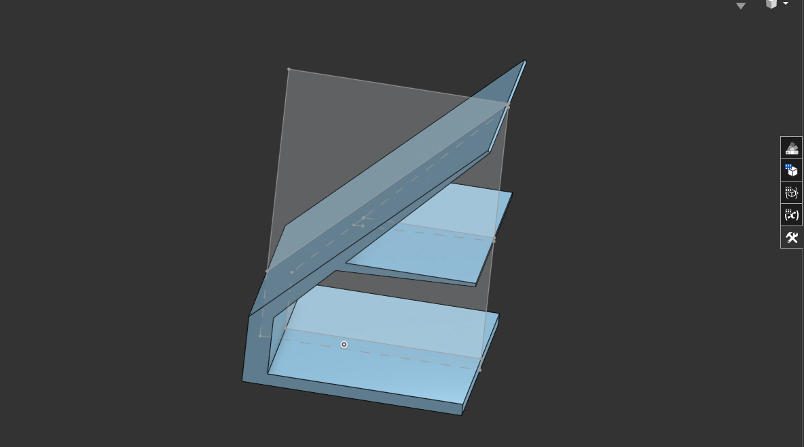

this is a crazy idea i had, but i thought about it and if i print something without the heated bed and consume an average of 200w, i have enough rc batteries to last 40 minutes which is enough for a benchy

also this will be my first print using the big print volume of the printer i made for infill

## solar panel, batteries and electronics holder
top shelf for electronics, it fits a pi and some relays etc

bottom shelf fits batteries 

## download:
printables link: 

## onshape:
https://cad.onshape.com/documents/33a456b3e1163ff25b3fab13/w/8fb2f07da52171af49bf852c/e/595651fa83a99b7be75c338c?renderMode=0&uiState=680d30eed2bec423020dbc98